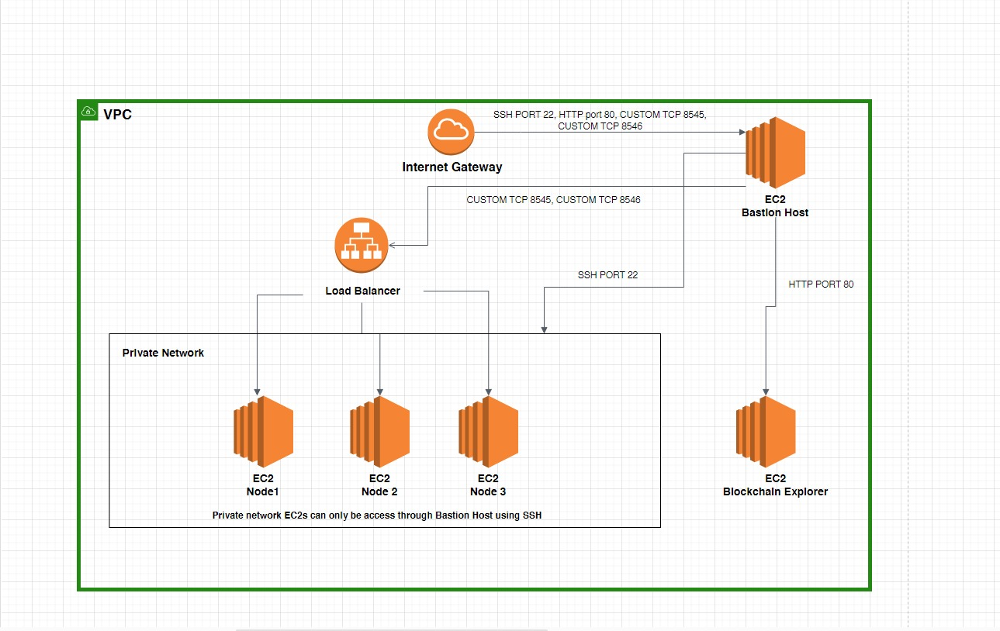

# CDK TypeScript project

## Useful commands

- `cdk init app --language typescript` intialize your cdk project in typescript
- `cdk synth` emits the synthesized CloudFormation template
- `cdk deploy` deploy this stack to your default AWS account/region

## Application Architechture



# Create stack in lib/cdk-stack.ts

## Resources

1. A VPC with 1 public subnet and 1 private subnet.
2. Bastion Host inside public subnet.
3. Load Balancer inside public subnet.
4. EC2 instance to server application, inside private subnet, connected to Application load balancer.

## Application Flow

We will receive traffic from the internet on Bastion host on port Ssh 22,HTTP 80,Custom TCP 8545 & 8546. Incomming Request from Bastion Host on Custom TCP 8545 & 8546 will be routed to Application load Balancer with target group forwarding the request to EC2 instance inside private subnet. (For testing purposes on;y one EC2 instance is deployed). The instance inside private subnet can be accessed through bastion hots ssh tunnelling.

## Stack code

- A VPC with 1 public subnet and 1 private subnet.

```javascript 
  const vpc = new ec2.Vpc(this, "alb-lambda-vpc", {
            maxAzs: 2,
            natGateways: 1,
            subnetConfiguration: [
              {
                cidrMask: 24,
                name: "ingress",
                subnetType: ec2.SubnetType.PUBLIC,
              },
              {
                cidrMask: 24,
                name: "application",
                subnetType: ec2.SubnetType.PRIVATE_WITH_EGRESS,
              },
            ],
          });

 ```
- Security group with rules

```javascript

      const serviceSG = new ec2.SecurityGroup(this, 'ServiceSecurityGroup', { 
        vpc,
         allowAllOutbound: true ,
         description: 'Security group for bastion host',
         securityGroupName: 'BastionSecurityGroup'
        });

     serviceSG.addIngressRule(ec2.Peer.anyIpv4(), ec2.Port.tcp(22))
      serviceSG.addIngressRule(ec2.Peer.anyIpv4(), ec2.Port.tcp(80))
       serviceSG.addIngressRule(ec2.Peer.anyIpv4(), ec2.Port.tcp(8545))
        serviceSG.addIngressRule(ec2.Peer.anyIpv4(), ec2.Port.tcp(8546))

```
- Iam role and policy
  
```javascript
      const appServerRole = new iam.Role(this, "AppServerRole", {
        assumedBy: new iam.ServicePrincipal("ec2.amazonaws.com")
      })

      appServerRole.addToPolicy(new iam.PolicyStatement({
      resources: ['*'],
      actions: ["ec2-instance-connect:SendSSHPublicKey"],
    }));

```
- EC2 inside private subnet. Note: Create a keypair "EC2KeyPair" from AWS console and download the key, then provide the name  of the key to the constructor.
 
  ```javascript

    const nodeEc2 = new ec2.Instance(this, "our-instances", {
      vpc,
      vpcSubnets: vpc.selectSubnets({ subnetType: ec2.SubnetType.PRIVATE_WITH_EGRESS }),
      machineImage: new ec2.AmazonLinuxImage({
        generation: ec2.AmazonLinuxGeneration.AMAZON_LINUX_2,
      }),
      instanceType: ec2.InstanceType.of(ec2.InstanceClass.T3, ec2.InstanceSize.MEDIUM),
      availabilityZone: vpc.availabilityZones[0],
      role: appServerRole,
      securityGroup: serviceSG,
      ssmSessionPermissions: true,
    })

    nodeEc2.instance.addPropertyOverride("KeyName", "BastionKeyPair")

  ```
- Bastion host in public subnet. Note: Create a keypair "EC2KeyPair" from AWS console and download the key, then provide the name  of the key to the constructor.
- 
  ```javascript

    const bastionHostLinux = new ec2.BastionHostLinux(this, 'BastionHostLinux', {  
          vpc: vpc,
          instanceName: "BastionHostLinux",
          instanceType: ec2.InstanceType.of(ec2.InstanceClass.T2, ec2.InstanceSize.SMALL),
          securityGroup: serviceSG,
          subnetSelection: {
            subnetType: ec2.SubnetType.PUBLIC
          }
    })
        bastionHostLinux.allowSshAccessFrom(ec2.Peer.anyIpv4())
        bastionHostLinux.instance.instance.addPropertyOverride("KeyName", "BastionKeyPair")
       

  ```
  - Create Application Load balancer 
 
 ```javascript
      const loadbalancer = new elbv2.ApplicationLoadBalancer(
      this,
      "alb-lambda-lb",
      {
        vpc,
        loadBalancerName: "albino",
        securityGroup:serviceSG,
        // http2Enabled: true,
        // securityGroup: serviceSG.securityGroupId,
        // internetFacing: true,
        vpcSubnets: vpc.selectSubnets({
          subnetType: ec2.SubnetType.PUBLIC,
        })
      }
    );

```
- Add Listner to ALB.

```javascript
    const listener2 = loadbalancer.addListener('PublicListener2', { 
      port: 8546, 
      open: false ,
      protocol: elbv2.ApplicationProtocol.HTTP,
    })

        listener1.connections.allowFrom(  
          bastionHostLinux ,
          ec2.Port.tcp(8545),
          "Allow all ingress 8545 traffic to be routed to the VPC"
        )
        listener2.connections.allowFrom(
          bastionHostLinux,
          ec2.Port.tcp(8546),
          "Allow all ingress 8546 traffic to be routed to the VPC"
        )

```
- Create a target group to attach to ALB on 8545 and 8456.

```javascript
        const targetGroup = new elbv2.ApplicationTargetGroup(
          this,
          "alb-ec2-target-group",
          {
            vpc,
            targetType: elbv2.TargetType.INSTANCE,
            targets: [new elbv2Targets.InstanceTarget(nodeEc2, 80)],
            port:80,
          }
        )
        
        listener1.addAction("alb-ec2-action1", {
          action: elbv2.ListenerAction.forward([targetGroup]), 
        });


        listener2.addAction("alb-ec2-action2", {
          action: elbv2.ListenerAction.forward([targetGroup]), 
        })

```

## Deploy the stack

-run *cdk synth* to see cloudformation inside cdkout directory.
-run *cdk deploy* ,(After bootstraping the aws account if not done already).
- now head over to AWS console to see the deployed resources with given configurations.
- next configure nginx server to connect Bastion Host to ALB.
- ssh into EC2 instance through Bastion Host ssh tunnelling (refer the given commands in the notes.md file), and clone the sample application. 
- Configure nginx server inside EC2 to the serve app.
- Now you can view your application on 
 http://Bastion-Host-IP:8545 & 
 http://Bastion-Host-IP:8546


